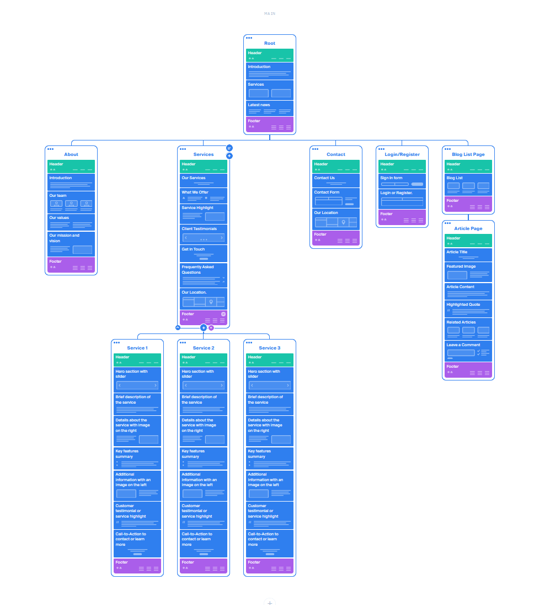
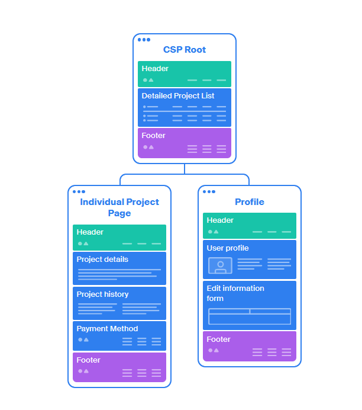
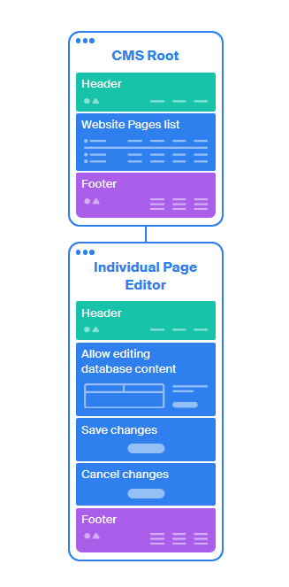
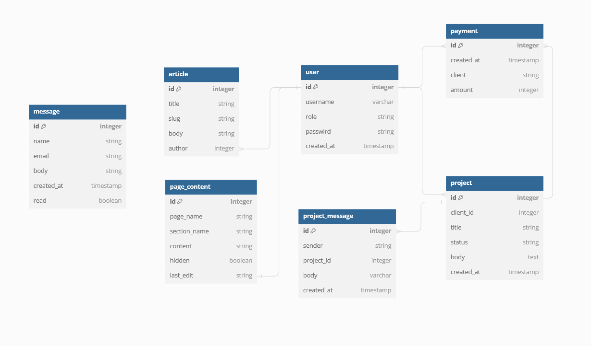
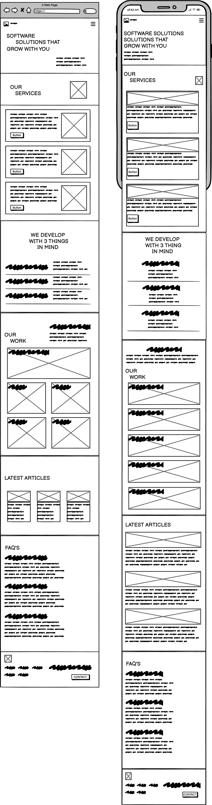

# Pixel It

!!!!! Add Image of site homepage !!!!!

# Project Overview

Pixel It is a fictional web development agency created to fit the criteria for the Milestone 4 project for the Code Institute Milestone 4 project criteria.

Pixel It is built using Django, Python, JavaScript and various frameworks as documented below. Payment functionality will be provided by Stripe. Pixel It is a creative web development agency offering various services such as Web Design, Web Development, Search Engine Optimisation and much more. A specialised user dashboard has been created allowing the user to create and define project requirements, allow for feedback and pay for such services through their account dashboard.

## TABLE OF CONTENTS

- [Project Overview](#project-overview)
- [UX Development](#ux-development)
  - [Strategy](#strategy)
    - [problems](#problems)
    - [Project Goals](#project-goals)
    - [User Demographic](#user-demographic)
    - [User Stories](#user-stories)
    - [Scope](#scope)
- [Structure](#structure)
  - [Topology](#topology)
  - [Database Schema](#database-schema)
- [Skeleton](#skeleton)
  - [Wireframes](#wireframes)
  - [Colour Scheme](#colour-schemes)
  - [Typography](#typography)
  - [Imagery](#imagery)
- [Features](#features)
  - [Multipage Elements](#multipage-elements)
  - [CRUD Table](#crud-table)
  - [Defensive Programming](#defensive-programming)
  - [Error Handling](#error-handling)
- [Technologies Used](#technologies-used)
- [Future Implementations](#future-implementations)
- [Testing](#testing)
  - [Bugs, Issues and Solutions](#bugs-issues-and-solutions)
- [Deployment](#deployment)
  - [cloning](#cloning)
  - [Forking](#forking)
- [Credits](#credits)
  - [Content](#content)
  - [Media](#media)
  - [Acknowledgments](#acknowledgements)

# UX Development

## Strategy

The goal of Pixel It is to create a viable low cost entry point to small to medium enterprises to establish and online presence. While researching online I came across [this](https://clutch.co/web-developers) website, albeit with an American bias but regional results returned comparitive costs, outlining estimated costs for website development.

While I'm sure the costs associated here are reasonable for their services, I feel that small to medium enterprises do not warrant the complex, highly functional websites that these agencies deliver for that price.

Pixel It takes a different approach by developing a website that grows with your business, built on Django, a Pixel It wbsite is able to start life as a small brochure website if that is all that is required and is able to elegantly evolve with the clients business to include the functionality of a full Client Relationship Management application.

Pixel It also makes it extremely easy and convenient for the client to manage their own services through the customer service portal of their website, allowing them to add or remove subscription based services, request and accept quotes for additional development tasks to their website, approve proposals and pay any balances due through their own account management section of the website.

### Problems

Ultimately, the goal of Pixel It is to address these fundamental barriers faced by small to medium enterprises whether they are new start ups or existing companies looking to refresh their online presence.

- Cost
  - As evidenced above, the cost of building a website can be very prohibitive. Many small companies do not have the free capital to be able to invest so heavily into their website during the early days. The result of this is that they often pay for a budget website or they use a WYSIWYG online website builder.
  The outcome for either of these scenarios is often the same, a website that is poorly built, poorly optimised and doesn't fit their needs.

- Trust
  - Their are many anecdotal horror stories circulating where a developer or agency overly exaggerates their competencies with any given tech stack leaving the client with a website that poorly represents them or in some cases the website is left unfinished.

- Clarity
  - Many web developers or agencies often leave their clients feeling mislead with project overuns or quotes that end up grossly inaccurate. Alongside this, a client can be left for weeks or even months at times with no idea of how their website is progressing.

### Project Goals

Pixel It intends to address the issues above with a different approach to building a website. By building the website to scale with the growth of the company it reduces the up front cost demanded of the client. This also reduces the risk taken by the client and therefore increases trust as they can see the outcome of their previous (smaller) investment before committing to investing further into their website and the customer service portal built into Pixel It's website allows the client to see and manage their project online further increasing trust by seeing the progress made on their website.

### User Demographic

The primary demographic targetted by Pixel It will be:

- Small &amp; medium enterprises
  - Start ups
  - Existing companies looking for a digital refresh
  - Ecommerce stores
  - SAAS services looking to outsource their website development
- Hobbyists
  - Individuals who need/want a website for their personal projects but don't want to use WYSIWYG editors

### User Stories

#### First Time Visitor Goals

As a first time visitor I want to be able to:

- Immediately understand the purpose of the website
- Easily find the services offered
- Browse information related to the history of the company
- Find information on the brand identity
- Easily find contact information

#### Returning Visitor Goals

As a returning visitor I want to be able to:

- Be able to find further information about specific services I may be interested in
- Submit a query to the site owner requesting further information or to generate a lead
- register for an account or log in to my existing account

#### Registered User Goals

As a registered user I want to be able to:

- Edit my profile and contact information
- Request a service
- Approve a proposal
- Request a modification to a proposal
- Message the project Manager at Pixel It
- Check the current status of a project in progress
- Pay outstanding balances
- Delete my account

#### Site Admin

As a site Admin I want to be able to:

- Use the admin panel of the website to edit information displayed on the website
- Use the customer Service portal to view information about ongoing projects
- Use the customer Service Portal to update project information
- Use the Customer Service Portal to communicate with a client

### Scope

The functionality of the website will greatly vary depending on the provileges granted to the users account. The three main categories of a registered user will be:
  - Guest
  - Client
  - Admin

Below I have created a Viability Analysis of the various features I intend to add to the website dependant on the users account roles that have been granted.

#### Guest

| #  | Feature                          | Importance | Viability |
|----|----------------------------------|------------|-----------|
| 1  | Submit Contact Form              | 3          | 5         |
| 2  | Register                         | 5          | 5         |
| 3  | Login                            | 5          | 5         |

#### Registered User

| #  | Feature                          | Importance | Viability |
|----|----------------------------------|------------|-----------|
| 1  | Submit Contact Form              | 3          | 5         |
| 2  | Login                            | 5          | 5         |
| 3  | Logout                           | 5          | 5         |
| 4  | Request Quote                    | 4          | 4         |
| 5  | Accept Quote                     | 4          | 5         |
| 6  | Decline Quote                    | 3          | 5         |
| 7  | View Project Status              | 3          | 5         |
| 8  | Add Comment to project           | 4          | 4         |
| 9  | Cancel Project                   | 3          | 5         |
| 10 | Add Service                      | 3          | 4         |
| 11 | Pay balance                      | 5          | 5         |

#### Admin

| #  | Feature                          | Importance | Viability |
|----|----------------------------------|------------|-----------|
| 1  | Login                            | 5          | 5         |
| 2  | Logout                           | 5          | 5         |
| 3  | View Contact Form Submissions    | 4          | 5         |
| 4  | View Project Details             | 5          | 5         |
| 5  | Edit Project Details             | 5          | 5         |
| 6  | Propose Quote                    | 5          | 5         |
| 7  | Add comment to project           | 5          | 5         |
| 8  | Cancel Project                   | 5          | 5         |
| 9  | Bill Client                      | 5          | 5         |

# Structure

## Topology

The website will have three main sections, the website itself, the admin panel for controlling the content of the website and the Customer Service Portal which will only vary slightly in appearance and functionality depending on the access roles of the current user.

The main website topology will be as follows:

The blog article pages will be dynamically rendered using database queries using the article slug as an identifier.

Upon logging the user will be able to use the Navigation Menu to access the Customer Portal portion of the Website, offering the following Topology:

Again, the individual project page will be a single page with dynamically generated content using the project ID as an identifier.

Finally, the content displayed on the main area of the website will be editable by the admins using the content management portion of the website, allowing for minor changes without having to directly edit code, to access this an admin will have a link in the navigation menu to access the Content Manageent System, offering the following Topology:

## Database Schema

Pixel it runs from a single Database containing multiple tables. Only users with sufficient privileges can perform CRUD functionality and such functionality will vary per user depending on their role.

The diagram below shows the Entity Relationship Diagram for the Database Tables.

# Skeleton

## Wireframes

Wireframes were created using [Balsamiq](https://balsamiq.com/)

### Homepage

## Colour Scheme

## Typography

## Imagery

# Features

## Multipage Elements

## CRUD Table

## Defensive Programming

## Error Handling

# Technologies Used

- [Octopus.do](https://octopus.do/)
  - Used for creating site topology map

- [Balsamiq](https://balsamiq.com/)
  - Used for creating wireframes

# Future Implementations

# Testing

## Bugs, Issues and Solutions

# Deployment

## cloning

## Forking

# Credits

## Content

- [http://meyerweb.com/eric/tools/css/reset/](Meyer Web)
  - Used for a CSS Reset boilerplate

- [https://codepen.io/tmrDevelops/pen/bpLPxo](Codepen Canvas Example)
  - Used for the background animation effect used across multiple pages of the website

## Media

- [www.unsplash.com](https://unsplash.com/)
  - Used for various stock photography used across the site

## Acknowledgments
